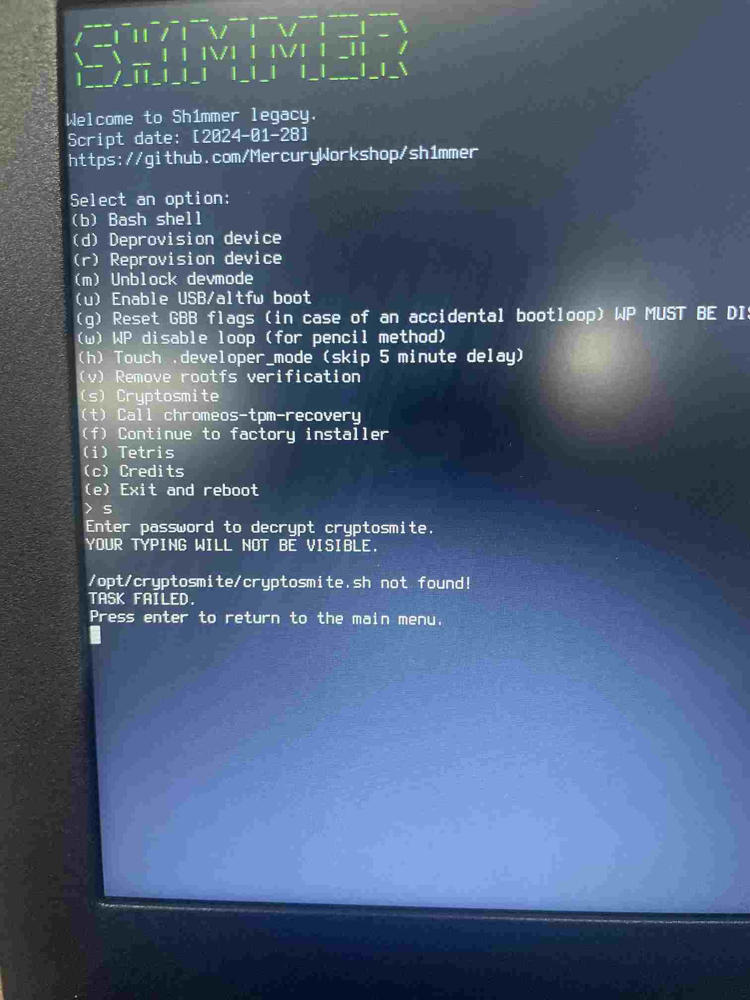

## Tabla de contenidos
{: .no_toc .text-delta }

1. TOC
{:toc}

---

## Shim RMA

Un shim RMA es una herramienta diseñada para ser usada por técnicos para resetear chromebooks, cambiar números de serie y corregir diagnósticos. 
En sí, es un archivo .bin similar a una imagen de recuperación normal, se escribe a un dispositivo usb y se conecta al chromebook. 


## Shimmer

Shimmer es una herramienta basada en los shims de fábrica, añadiendo su propio código, pudiendo ejecutarlo sin restricciones del sistema.
Para usarlo simplemente hay que escribir la imagen a un dispositivo usb, y conectarlo a un chromebook, donde se copiarán todos los datos a la ram, después de esto se podrá desconectar el dispositivo usb.

Leer mas acerca de esto en: [Blog coolelectronics]


## Herramientas Shimmer

Al arrancar la imagen de Shimmer se nos presenta un simple menú CLI, donde hay varias opciones:

```(p)``` Abre un menu con "payloads", pequeños programas que ya vienen con Shimmer \
```(b)``` Abre una terminal bash, el usuario siendo root (cada comando se ejecuta como si fuese sudo) \
```(d)``` “Libera” el dispositivo (no funciona desde v111 en adelante) \
```(r)``` Revierte los cambios hechos por (d) \
```(m)``` Desbloquea el modo desarrollador \
```(u)``` Activa el arranque desde usb o bootloader alternativo \
```(g)``` Cambia ggb flags a 0x0000, la protección de escritura debe estar desactivada \
```(w)``` Borra todos los datos en la partición primaria \
```(h)``` Quita el tiempo de espera de 5 minutos al activar modo desarrollador \
```(v)``` Quita la verificación de rootfs, permite acceso completo de lectura y escritura al sistema \
```(t)``` En mi experiencia, cambia kernver a 0x000100001 \
```(f)``` Abre un shim de fábrica estándar \
```(i)``` Es literalmente el tetris \
```(c)``` Creditos \
```(e)``` Reinicia el ordenador

Ejemplo del menu:



{: .note}
>Estos son los comandos principales, pueden ir cambiando segun la version de Shimmer
>
>El teclado se pone en ingles, por lo que algunas teclas cambian

__Comandos destacados__

```vpd```: Se usa para cambiar “vital product data”, donde se encuentra información acerca del dispositivo. \
```flashrom```: Herramienta de código abierto para leer y escribir a chips de firmware, se puede usar para comprobar el estado de protección de escritura y cambiarlo, entre otros usos. \
```/usr/share/vboot/bin/get_gbb_flags.sh```: Devuelve flags de gbb. \
```/usr/share/vboot/bin/set_gbb_flags.sh```: permite establecer nuevos flags de gbb, necesita tener la protección de escritura desactivada. \
```crossystem```: Imprime información adicional sobre el sistema, recomiendo usar con ```| more``` o ```| less```.

[Blog coolelectronics]: https://blog.coolelectronics.me/breaking-cros-2/ 